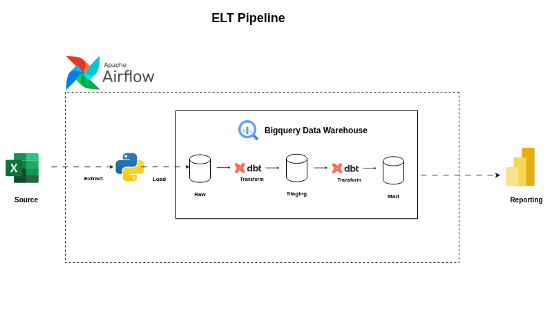

# Sales Data Warehouse

## Project Architecture

    

## Project workflow

Create a web portal where sales people will dump monthly sales data. The portal will process the file and store it in google cloud storage bucket.

Upon landing in the bucket, a cloud run function job will trigger an airflow job. Airflow will then process and transform the monthly sales data and model it into a medallion style data warehouse architecture.

### Web portal creation

Web portal has been created. Use fast api and a simple UI with html, css and js.

It can able to validate that only excel files can be uploaded here but however, no file size validation has been setup here. Need to work on it.

### GCS Bucket setup

Setup my google cloud bucket with multi region and standard class storage option. The data is quite small so no need to worry about cost optimization but, it is important that the architecture is setup in a way that avoids region to region egress.

### Validate that my web portal works or not

In order to proceed with this step, first I need to create a service account that will basically handle the upload of files on google cloud. 

I created the account and also, assigned a storage object creator user, that will let the service account upload files but not overwrite it or replace it.

DONE. Was facing a slight issue on the service account file path but now it works. Nice! Also checked whether it could be overwritten or not, It can't do it, This is exactly what i wanted and the storage object creator user role is designed to do exactly that!

--- 

The easy part is done, hard part is coming ...

~~### Configuring my bucket to send notifications about object changes to a Pub/Sub Topic ~~

~~Refer to this doc: https://docs.cloud.google.com/storage/docs/reporting-changes ~~

Change of plans!

Architecture wise, I have already setup gcs bucket that will intially host the monthly provided excel file.

Now will use a cloud run function that will automatically trigger itself the moment the data lands on the cloud storage bucket. See this [link](https://docs.cloud.google.com/run/docs/triggering/storage-triggers).

