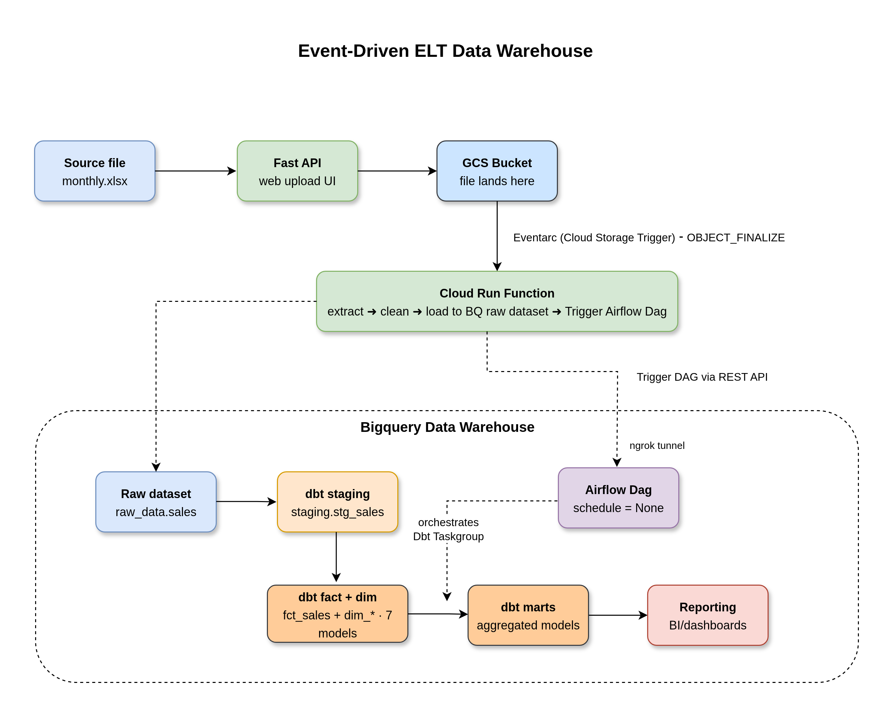
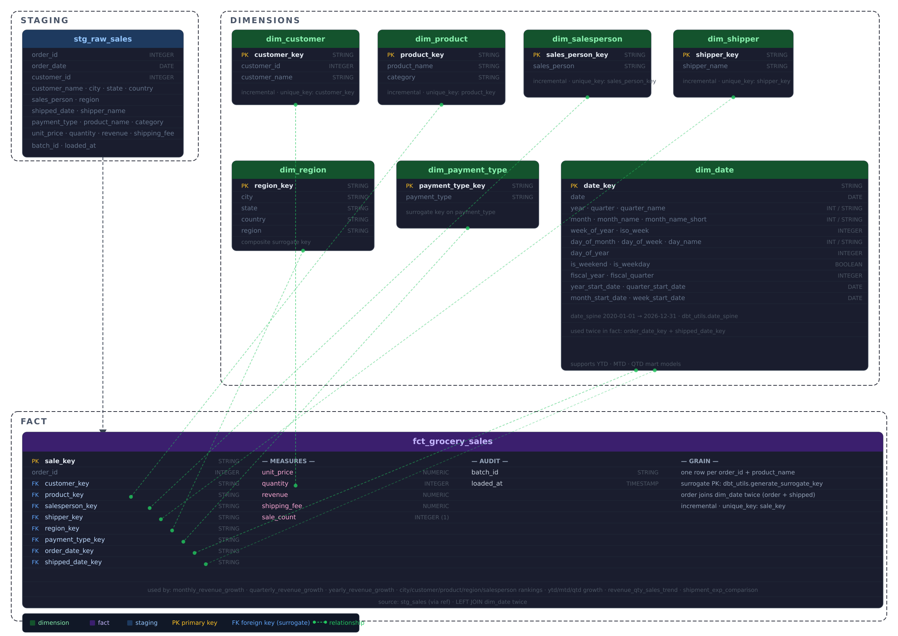

# Event-Driven ELT Cloud Data Warehouse

An end-to-end, event-driven ELT pipeline that ingests monthly Excel sales files through a web UI, stores them in Google Cloud Storage, triggers a Cloud Run function to extract and load raw data into BigQuery, and then orchestrates dbt transformations via Apache Airflow to build a full dimensional data warehouse.

---

## Architecture overview


<p>
    
</p>


```
Browser (Upload UI)
        │  HTTP POST /upload
        ▼
FastAPI (web_portal/main.py)          ← run locally via uvicorn + ngrok
        │  stream file
        ▼
GCS Bucket (sales-dw-bucket)
        │  OBJECT_FINALIZE event → Eventarc
        ▼
Cloud Run Function (cloud_run/main.py)
        │  extract · clean · load → BigQuery raw_data.sales
        │  POST /api/v2/dags/transform/dagRuns
        ▼
Airflow DAG (dags/transform.py)       ← local, exposed via ngrok
        │  schedule=None (event-driven only)
        ▼
dbt TaskGroup (dags/dbt/sales_dw_pipeline/)
        │  staging → marts
        ▼
BigQuery Data Warehouse
        └── staging.stg_sales
        └── marts.dim_customer / dim_product / dim_date / …
        └── marts.fct_grocery_sales
        └── marts.monthly_revenue_growth / yearly / quarterly / …
```

---

## Project structure

```
sales-datawarehouse/
├── web_portal/                  # FastAPI upload UI
│   ├── main.py                  # /upload endpoint → GCS
│   └── index.html               # drag-and-drop UI
│
├── cloud_run/                   # ← place your Cloud Run function here
│   ├── main.py                  # extract · clean · load BQ · trigger Airflow
│   └── requirements.txt
│
├── dags/
│   ├── transform.py             # Airflow DAG (dbt only, schedule=None)
│   └── dbt/sales_dw_pipeline/
│       ├── models/
│       │   ├── staging/         # stg_raw_sales.sql, stg_sales.sql
│       │   └── marts/
│       │       ├── dimension/   # dim_customer, dim_date, dim_product, …
│       │       ├── fact/        # fct_grocery_sales
│       │       ├── rankings/    # city, customer, product, region, salesperson
│       │       └── ytd_mtd_qtd/ # YTD, MTD, QTD growth models
│       ├── tests/               # custom data quality tests
│       └── dbt_project.yml
│
├── include/
│   └── gcp/
│       ├── service_account.json             # Airflow → BigQuery SA key
│       └── sales-upload-bucket-service-account-key.json  # FastAPI → GCS SA key
│
├── assets/
│   └── old_architecture.png
├── .env
├── Dockerfile
├── packages.txt
└── requirements.txt
```

---

## Prerequisites

| Tool | Version | Purpose |
|------|---------|---------|
| Python | 3.12+ | FastAPI + Cloud Run function |
| Astro CLI | latest | Local Airflow via Docker |
| Docker Desktop | latest | Airflow containers |
| ngrok | latest | Expose local Airflow to Cloud Run |
| GCP project | — | GCS, BigQuery, Cloud Run, Eventarc |
| gcloud CLI | latest | Deploy Cloud Run function |

---

## GCP setup (one-time)

### 1. Service accounts

Create two service accounts in your GCP project:

**For FastAPI → GCS upload:**
```bash
gcloud iam service-accounts create sales-upload-sa \
  --display-name="Sales Upload SA"

gcloud projects add-iam-policy-binding YOUR_PROJECT \
  --member="serviceAccount:sales-upload-sa@YOUR_PROJECT.iam.gserviceaccount.com" \
  --role="roles/storage.objectCreator"

gcloud iam service-accounts keys create \
  include/gcp/sales-upload-bucket-service-account-key.json \
  --iam-account=sales-upload-sa@YOUR_PROJECT.iam.gserviceaccount.com
```

**For Airflow/dbt → BigQuery:**
```bash
gcloud iam service-accounts create airflow-bq-sa \
  --display-name="Airflow BigQuery SA"

gcloud projects add-iam-policy-binding YOUR_PROJECT \
  --member="serviceAccount:airflow-bq-sa@YOUR_PROJECT.iam.gserviceaccount.com" \
  --role="roles/bigquery.dataEditor"

gcloud iam service-accounts keys create \
  include/gcp/service_account.json \
  --iam-account=airflow-bq-sa@YOUR_PROJECT.iam.gserviceaccount.com
```

### 2. GCS bucket

```bash
gcloud storage buckets create gs://sales-dw-bucket --location=US
```

### 3. BigQuery datasets

```bash
bq mk --dataset YOUR_PROJECT:raw_data
bq mk --dataset YOUR_PROJECT:staging
bq mk --dataset YOUR_PROJECT:warehouse
```

### 4. Eventarc trigger for Cloud Run (after deploying the function)

```bash
gcloud run deploy sales-el-function \
  --source ./cloud_run \
  --region us-central1 \
  --no-allow-unauthenticated \
  --trigger-event-filters="type=google.cloud.storage.object.v1.finalized" \
  --trigger-event-filters="bucket=sales-dw-bucket"
```

---

## Local development startup sequence

Follow these steps **in order** every time you want to run the full pipeline locally.

### Step 1 — Start the FastAPI upload server

```bash
# From the project root
cd web_portal
source ../venv/bin/activate      # activate the venv
uvicorn main:app --reload --port 8000
```

The upload UI is now at `http://localhost:8000`.

### Step 2 — Start Airflow (Astro CLI)

Open a new terminal, from the project root:

```bash
astro dev start
```

Wait for all containers to be healthy (usually 30–60 seconds). Airflow UI opens automatically at `http://localhost:8080`.

Make sure the `transform` DAG is **unpaused** — you can do this from the UI or via CLI:

```bash
# confirm the DAG is visible
curl -X GET \
  "http://localhost:8080/api/v2/dags/transform" \
  -H "Authorization: Bearer $(curl -s -X POST http://localhost:8080/auth/token \
    -H 'Content-Type: application/json' \
    -d '{"username":"admin","password":"admin"}' | python3 -c "import sys,json; print(json.load(sys.stdin)['access_token'])")"
```

### Step 3 — Expose Airflow via ngrok

Open another terminal:

```bash
ngrok http 8080
```

Note the forwarding URL — it looks like:
```
Forwarding   https://xxxx-xxxx.ngrok-free.app -> http://localhost:8080
```

Copy this URL. You need it in the next step.

### Step 4 — Update the Cloud Run function URL

In `cloud_run/main.py`, set the ngrok URL:

```python
AIRFLOW_BASE_URL = "https://xxxx-xxxx.ngrok-free.app"
```

Then redeploy the Cloud Run function:

```bash
gcloud run deploy sales-el-function \
  --source ./cloud_run \
  --region us-central1 \
  --no-allow-unauthenticated
```

> **Note:** The free tier of ngrok generates a new URL each session. You need to redeploy the Cloud Run function with the new URL each time you restart ngrok.

### Step 5 — Test the Airflow trigger manually (optional)

Before uploading a real file, confirm the full chain works:

```bash
# 1. get a token
TOKEN=$(curl -s -X POST \
  "https://xxxx-xxxx.ngrok-free.app/auth/token" \
  -H "Content-Type: application/json" \
  -d '{"username": "admin", "password": "admin"}' \
  | python3 -c "import sys,json; print(json.load(sys.stdin)['access_token'])")

# 2. trigger the DAG
curl -X POST \
  "https://xxxx-xxxx.ngrok-free.app/api/v2/dags/transform/dagRuns" \
  -H "Content-Type: application/json" \
  -H "Authorization: Bearer $TOKEN" \
  -d "{\"logical_date\": \"$(date -u +%Y-%m-%dT%H:%M:%SZ)\", \"conf\": {}}"
```

A `{"dag_run_id": "...", "state": "queued"}` response means everything is wired correctly.

### Step 6 — Upload a file

Open `http://localhost:8000` in your browser. Drag and drop the monthly Excel sales file (`.xlsx` or `.xls`) into the upload zone and click **Upload**.

**What happens next (automatically):**

1. FastAPI streams the file to `gs://sales-dw-bucket/`
2. GCS fires an `OBJECT_FINALIZE` event → Eventarc
3. Cloud Run function receives the event, reads the xlsx from GCS into memory, cleans column names, checks for duplicate batches, and loads data into `raw_data.sales` in BigQuery
4. Cloud Run function calls the Airflow REST API to trigger the `transform` DAG
5. Airflow runs the dbt TaskGroup — staging models first, then dimension tables, fact table, and all mart models
6. Your BigQuery data warehouse is fully refreshed

---

## Cloud Run function

Place the following files in `cloud_run/`:

**`cloud_run/main.py`** — the full extract-and-load logic (see conversation for complete code).

**`cloud_run/requirements.txt`:**

```txt
functions-framework==3.*
requests>=2.31.0
pandas>=2.0.0
openpyxl>=3.1.0
google-cloud-bigquery>=3.11.0
google-cloud-storage>=2.16.0
pyarrow>=15.0.0
```

---

## Airflow connections

Set these up in the Airflow UI under **Admin → Connections**:

| Conn ID | Type | Details |
|---------|------|---------|
| `gcp_bigquery` | Google Cloud | Path to `include/gcp/service_account.json` |


---

## Data Warehouse

This warehouse is a classic star schema — one central fact table surrounded by 7 dimension tables, all joined on surrogate keys generated by `dbt_utils.generate_surrogate_key`.

<p>
    
</p>

Detailed Information:

| Layer | Models |
|-------|--------|
| Staging | `stg_raw_sales`, `stg_sales` |
| Dimensions | `dim_customer`, `dim_date`, `dim_payment_type`, `dim_product`, `dim_region`, `dim_salesperson`, `dim_shipper` |
| Fact | `fct_grocery_sales` |
| Marts | `monthly_revenue_growth`, `quarterly_revenue_growth`, `yearly_revenue_growth`, `revenue_qty_sales_trend_by_year_quarter_month`, `shipment_exp_comparison_by_ship_company` |
| Rankings | `city_rank_by_revenue_qty_sales`, `customer_rank_by_revenue_qty_sales`, `product_rank_by_revenue_qty_sales`, `region_rank_by_revenue_qty_sales`, `salesperson_rank_by_revenue_qty_sales` |
| YTD/MTD/QTD | `ytd_revenue_qty_shipment_growth`, `mtd_revenue_qty_shipment_growth`, `qtd_revenue_qty_shipment_growth` |

---

## Stopping everything

```bash
# Stop Airflow containers
astro dev stop

# Kill uvicorn: Ctrl+C in that terminal

# Kill ngrok: Ctrl+C in that terminal
```
